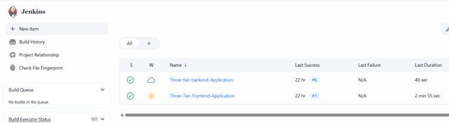
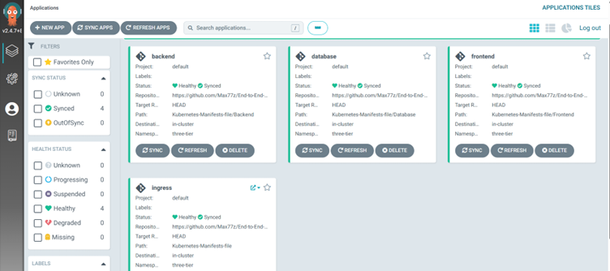
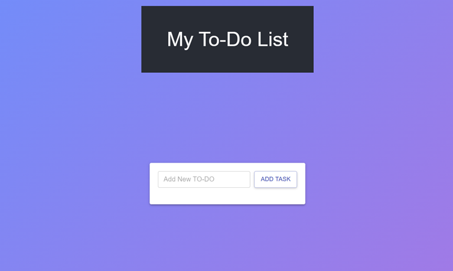
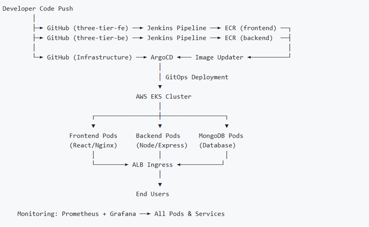

# End-to-End Kubernetes Three-Tier DevSecOps Project

This repository demonstrates a complete DevSecOps implementation of a three-tier microservices-based application deployed on AWS EKS.  
The project covers infrastructure provisioning, CI/CD automation, security scanning, GitOps-based deployment, and monitoring.

The application consists of:
- ReactJS frontend
- Node.js backend
- MongoDB database

The focus of this repository is on **infrastructure, CI/CD pipelines, Kubernetes manifests, and GitOps workflows**, rather than application feature development.

---

## Repository Structure

End-to-End-Kubernetes-Three-Tier-DevSecOps-Project/
├── Application-Code/
├── Jenkins-Pipeline-Code/
├── Jenkins-Server-TF/
├── Kubernetes-Manifests-file/
├── assets/
│   └── screenshots/
├── README.md
└── LICENSE

## Project Overview

This project implements an end-to-end DevSecOps workflow using AWS and Kubernetes.  
It demonstrates how application code moves from GitHub through automated CI pipelines, security checks, containerization, and finally into a Kubernetes cluster using GitOps principles.

Key capabilities include:
- Automated infrastructure provisioning with Terraform
- Jenkins-based CI/CD pipelines
- Container image security scanning
- Kubernetes deployment on AWS EKS
- GitOps-based delivery using Argo CD
- Observability using Prometheus and Grafana

---

## Project Snapshots

### Jenkins CI/CD Pipeline

The Jenkins pipeline automates:
- Code checkout
- Static code analysis (SonarQube)
- Dependency vulnerability scanning
- Container image build
- Push to Amazon ECR
- Image version updates for GitOps deployment

---

### Argo CD – GitOps Application Management

Argo CD continuously synchronizes Kubernetes manifests stored in Git with the EKS cluster.  
It ensures the deployed state always matches the declared configuration.

---

### Deployed Application

The final application is exposed using an AWS Application Load Balancer created dynamically by the AWS Load Balancer Controller.

---

### High-Level Architecture

The architecture below shows the complete flow from source code to deployment, including CI/CD, container registry, Kubernetes, and monitoring components.

---

## Tools and Technologies

### Cloud & Infrastructure
- AWS
- Terraform
- AWS CLI
- Amazon EKS
- Amazon ECR
- Application Load Balancer (ALB)

### CI/CD & GitOps
- Jenkins
- Argo CD
- GitHub

### Security & Quality
- SonarQube
- OWASP Dependency-Check
- Trivy

### Observability
- Prometheus
- Grafana

### Containers & Orchestration
- Docker
- Kubernetes
- Helm

---

## High-Level Workflow

1. **Infrastructure Provisioning**
   - Terraform provisions AWS resources such as VPC, EKS cluster, Jenkins server, and state backends (S3 + DynamoDB).

2. **CI Pipeline Execution**
   - Jenkins pulls source code from GitHub.
   - Code quality and security scans are executed.
   - Docker images are built and pushed to Amazon ECR.

3. **GitOps Deployment**
   - Image version updates are committed to the Kubernetes manifests repository.
   - Argo CD detects changes and synchronizes them to the EKS cluster.

4. **Application Exposure**
   - Services are exposed via Kubernetes Ingress.
   - AWS Load Balancer Controller provisions an ALB dynamically.

5. **Monitoring**
   - Prometheus scrapes metrics from the cluster.
   - Grafana visualizes system and application performance.

---

## Application Code

The application code has been separated into independent repositories for better modularity and scalability:

- **Frontend**: ReactJS application served via Nginx  
- **Backend**: Node.js / Express API connected to MongoDB  

This repository focuses on infrastructure, CI/CD, and deployment automation rather than application feature development.

---

## Jenkins Pipeline Code

The `Jenkins-Pipeline-Code` directory contains Jenkins pipeline definitions that automate:
- Build
- Test
- Security scanning
- Containerization
- Image publishing

These pipelines are designed to run in a repeatable and automated manner with minimal manual intervention.

---

## Jenkins Server Terraform

The `Jenkins-Server-TF` directory includes Terraform configurations used to:
- Provision an EC2-based Jenkins server
- Configure required IAM roles and permissions
- Enable integration with AWS services

---

## Kubernetes Manifests

The `Kubernetes-Manifests-file` directory contains:
- Deployments
- Services
- Ingress resources
- Configuration required for GitOps-based deployment via Argo CD

Ingress is configured to work with AWS ALB, including proper health checks and routing rules.

---

## Notes on Ingress and Health Checks

- AWS ALB health checks are explicitly configured to point to valid application endpoints.
- Host-based routing is optional; when omitted, applications can be accessed directly using the ALB DNS name.
- This configuration allows easy testing without requiring a custom domain.

---

## Monitoring and Observability

- Prometheus collects metrics from Kubernetes components and workloads.
- Grafana dashboards provide visibility into cluster health and application performance.

This setup allows early detection of performance and stability issues.

---

## License

This project is licensed under the Apache 2.0 License.

---

## Summary

This repository demonstrates a practical implementation of DevSecOps principles using modern cloud-native tools.  
It reflects real-world practices for infrastructure automation, CI/CD, Kubernetes deployment, and operational visibility.
Go Devops :)
